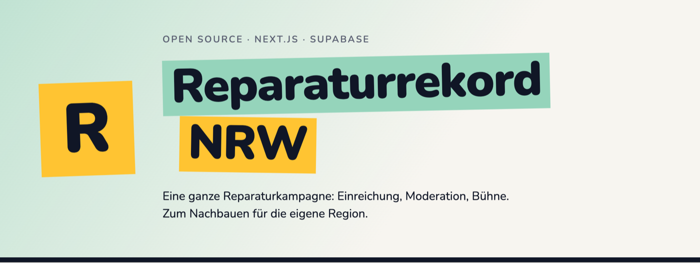
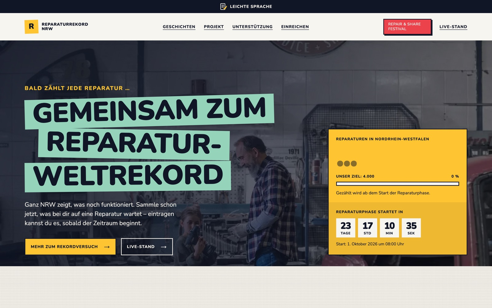
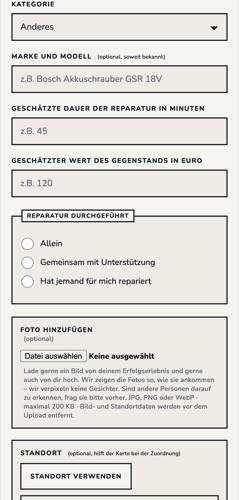
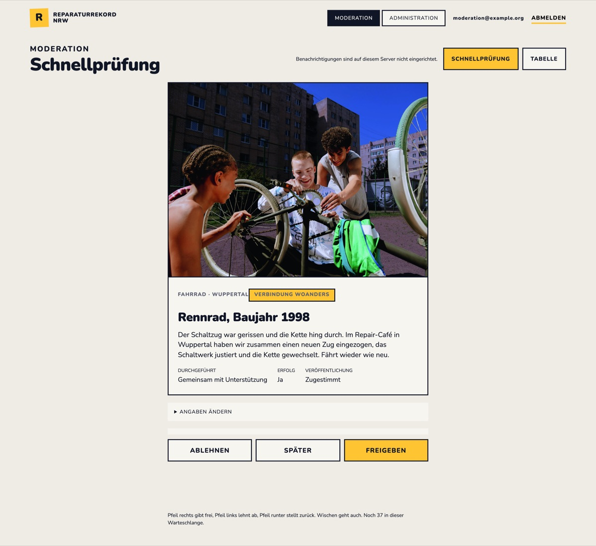
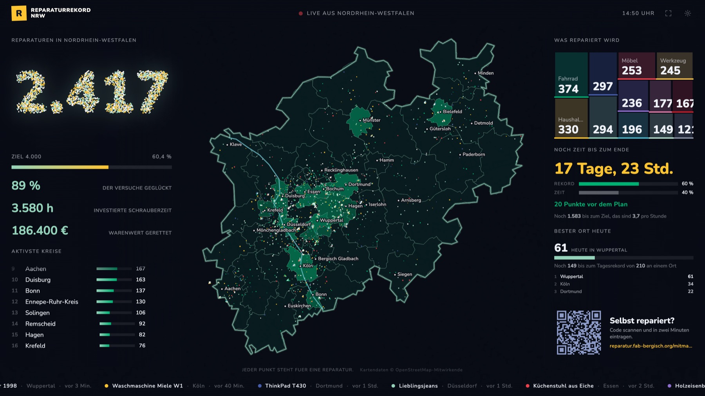
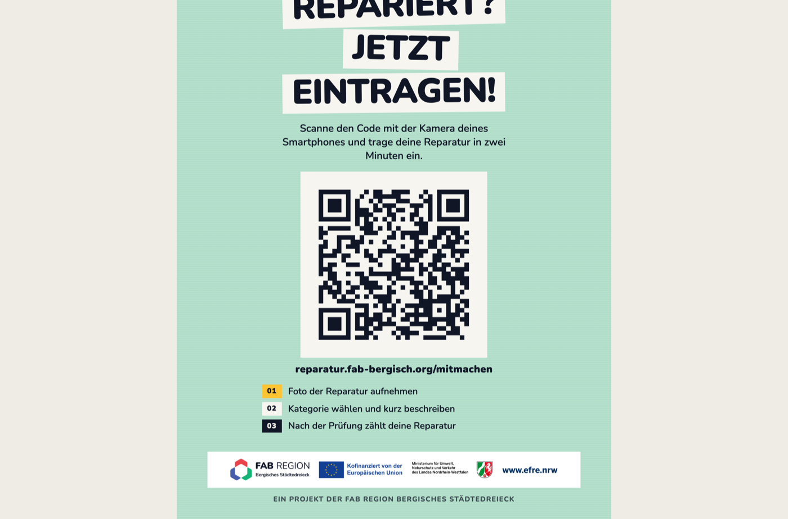
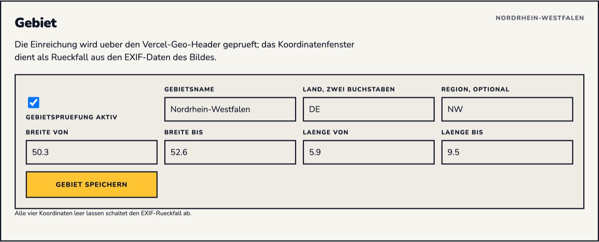
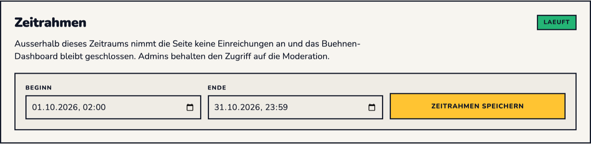

<p align="center">
  
</p>

<p align="center">
  <a href="https://reparatur.fab-bergisch.org"><strong>reparatur.fab-bergisch.org</strong></a>
  &nbsp;·&nbsp; Next.js 16 &nbsp;·&nbsp; Supabase &nbsp;·&nbsp; Vercel
  &nbsp;·&nbsp; <a href="LICENSE">BSD 2-Clause</a>
</p>

---

Eine Reparaturkampagne braucht mehr als ein Formular. Sie braucht einen Weg, auf dem
jemand in zwei Minuten am Küchentisch eine Reparatur einträgt. Eine Moderation, die
zweitausend Einreichungen auf dem Handy abarbeiten kann, ohne dass zwei Leute
dieselbe doppelt prüfen. Eine Leinwand, die im Foyer stundenlang läuft und den Stand
zeigt. Einen Aufsteller mit QR-Code, den ein Repair-Café selbst ausdruckt. Und einen
Umgang mit Fotos und Standorten, der einer Datenschutzprüfung standhält.

Das alles steckt hier drin — im Einsatz für den Weltrekordversuch in
Nordrhein-Westfalen im Rahmen der Circular Week 2026, und ausgelegt darauf, dass eine
andere Region es übernimmt.



## Inhalt

- [Was drin ist](#was-drin-ist)
- [Warum darauf aufbauen und nicht neu anfangen](#warum-darauf-aufbauen-und-nicht-neu-anfangen)
- [Umbau auf eine andere Region](#umbau-auf-eine-andere-region)
- [Wie es gebaut ist](#wie-es-gebaut-ist)
- [Lokal starten](#lokal-starten)
- [Dokumentation](#dokumentation)

## Was drin ist

### Einreichen in zwei Minuten, ohne Konto

Kategorie, ein paar Angaben, optional ein Foto — das ist alles. Kein Name, keine
E-Mail-Adresse, keine Anmeldung. `/mitmachen` ist eine eigene, mobil gedachte Seite
und damit das Ziel jedes QR-Codes: Wer scannt, landet direkt im Formular statt auf
einer Startseite, die er erst wegscrollen muss.

Das Bild wird **im Browser** neu gerendert, bevor es hochgeladen wird. Dabei fallen
EXIF- und GPS-Daten weg und die Datei schrumpft auf höchstens 200 KB. Was den
Rechner der einreichenden Person verlässt, enthält die Metadaten also gar nicht mehr.



### Moderation, die eine Warteschlange wirklich abarbeitet

Die Schnellprüfung zeigt eine Einreichung groß auf dem Bildschirm: Foto, Text,
Angaben, Herkunft. Pfeil rechts gibt frei, Pfeil links lehnt ab, Pfeil runter stellt
zurück — auf dem Handy geht Wischen genauso. Angaben lassen sich vor der Freigabe
korrigieren, ohne die Ansicht zu verlassen.

- **Kein Doppelprüfen.** Eine geöffnete Einreichung wird für die eigene Sitzung
  beansprucht (`claim_next_repair()`); zwei Moderierende bekommen nie dieselbe.
- **Herkunftssignale nebeneinander.** Widersprechen sich Foto-GPS, Standortfreigabe
  und selbst gewählter Kreis, stehen alle Angaben da statt nur der letzten — die
  Moderation entscheidet, ob die Reparatur für die Region zählt.
- **Freigeben ohne Foto** als eigene Entscheidung, für den Fall „Reparatur stimmt,
  Bild soll nicht öffentlich werden“. Bei einer Ablehnung verschwindet das Bild
  sofort aus dem Storage.
- **Push-Benachrichtigung** bei neuen Einreichungen — aber nur für angemeldete
  Moderationskonten, auf deren eigenen Geräten, hinter einem Umschalter. Öffentliche
  Seiten registrieren den Service Worker nicht einmal, es gibt dort also keine
  Erlaubnisabfrage. Nachprüfbar mit einem `grep`, siehe
  [`docs/push-notifications.md`](docs/push-notifications.md).



### Eine Bühne, die stundenlang läuft

`/stats` ist für den Beamer im Foyer gebaut: Zähler, Landkarte mit einem Punkt je
Reparatur, Kreis-Rangliste, Kategorien als Treemap, Laufband der letzten 24 Stunden,
Fortschritt gegen Ziel und Tagesrekord, QR-Code zum Mitmachen.

Der Client lädt **einmal** einen vollen Snapshot und danach nur noch Deltas, damit ein
Screen, der einen Monat lang läuft, die Datenbank nicht flutet. Die Seite kennt drei
Zustände unter einer Adresse — vor dem Start verschlossen, während der Aktion die
Bühne, danach ein Rückblick — und schaltet von selbst um, ohne dass jemand neu lädt.



### Herkunft auf der Karte, ohne den Ort zu kennen

Die Koordinate wird **im Browser** um eine zufällige Strecke von bis zu einem
Kilometer verschoben und auf rund 110 Meter gerundet. Nur dieser verschobene Punkt
und der daraus abgeleitete Kreisname werden gesendet. Der Server nimmt einen Wert
überhaupt nur an, wenn er gerundet ist und in der konfigurierten Region liegt.

Die Regionsprüfung selbst läuft über die Geo-Header von Vercel, mit dem
Koordinatenfenster aus dem Bild als Rückfall. Eine Roh-IP landet nie in der
Reparaturdatenbank; das Einreichungslimit zählt über einen gesalzenen SHA-256-Abdruck,
dessen Zeilen sich nach einer Stunde selbst aufräumen.

### Offene Schnittstellen für eigene Anzeigen

Alles, was die Bühne zeigt, ist ohne Schlüssel und ohne Anmeldung abrufbar —
gedacht für ein Display in der Werkstatt, im Schaufenster oder auf der eigenen
Website. `/api-doku` dokumentiert jede Route mit Feldbedeutungen, Zuständen,
Ratenlimits und Beispielcode für ESP32, Arduino und Raspberry Pi. Zusätzlich liegt
unter `/llms.txt` eine Kurzfassung für Sprachmodelle.

### Aufsteller selbst drucken

`/aufsteller` ist ein Generator, keine feste Vorlage: Format (A4 einzeln, A5 zu zwei,
A6 zu vier je Bogen), Sprache (Deutsch, Englisch, Arabisch oder dreisprachig),
Hintergrund, Förderlogos, die drei Schritte und die Schnittmarken sind einzeln
schaltbar. Gedruckt wird mit dem Druckdialog des Browsers. Der QR-Code ist ein
SVG-Pfad, skaliert also in jedem Format und nimmt seine Farben aus dem CSS.



### Und dazu

- **Gewinnspiel** mit öffentlichen Teilnahmebedingungen, gestifteten Preisen aus dem
  Backend, Ausschlussliste und einer eigenen **Bühnenziehung** für die Hauptpreise auf
  der Leinwand.
- **Geschichten** als versionierte Markdown-Dateien in `content/stories/`, statisch
  gebaut. Ein neuer Beitrag ist eine Datei, kein Datenbankzugang — die Anleitung fürs
  Redaktionsteam liegt daneben in
  [`content/stories/README.md`](content/stories/README.md).
- **Festivalseiten** samt Anreise und Initiativen-Aufruf, mit einem eigenen Baustein
  für „steht noch nicht fest“, damit ein offenes Programm keine Zahlen erfindet.
- **Dreimal installierbar** (PWA): Hauptseite, Schnelleintragung und Moderation als
  eigene Apps mit eigenem Icon und Namen. Die Moderation steht bewusst *nicht* in der
  öffentlichen Shortcut-Liste.
- **Repair-Café-Finder**, der auf die bestehenden Verzeichnisse verlinkt statt eine
  zweite Termindatenbank zu pflegen.
- **Leichte Sprache**, Barrierefreiheitserklärung, Tastaturbedienung und
  Alt-Texte für jedes Foto.
- **Ein einwilligungspflichtiger Dienst, ehrlich behandelt.** Ohne Entscheidung wird
  `<Analytics />` gar nicht gerendert — das Skript wird also nie geladen, statt es zu
  laden und Ereignisse zu filtern. Ablehnen ist genauso leicht wie Annehmen.
- **Backend für die Kampagne:** Zeitraum, Ziel, Tagesrekord, Gebiet, Logo, Team und
  Rollen, Partner, Preise, plus ein Notschalter, der alle öffentlichen Leseroute
  drosselt, wenn ein Kontingent knapp wird — sofort und ohne Deployment.
- **Bilder** liegen in einem privaten Bucket und werden nur über kurzlebige signierte
  URLs ausgeliefert. Freigegebene Reparaturen bekommen ein eigenes
  Open-Graph-Bild.

## Warum darauf aufbauen und nicht neu anfangen

Ein Einreichungsformular ist an einem Wochenende gebaut. Was danach kommt, ist die
Arbeit — und genau das liegt hier schon fertig:

| Das kostet beim Neubau Wochen | Hier |
| --- | --- |
| Moderation für tausende Einreichungen, ohne Doppelarbeit | Schnellprüfung mit Anspruchsvergabe in der Datenbank, Tabelle mit Filtern, CSV-Export |
| Fotos rechtssicher behandeln | EXIF-Entfernung im Browser, privater Bucket, signierte URLs, Löschung einzelner Bilder, Freigabe ohne Foto |
| Standort zeigen, ohne den Ort zu verraten | Verschiebung und Rasterung im Browser, serverseitige Plausibilitätsprüfung, Aggregation in einer einzigen SQL-Funktion |
| Ein Dashboard, das einen Monat durchläuft | Snapshot plus Deltas, CDN-Cache, In-Memory-Cache, Ratenlimits je Route, Drosselschalter |
| Missbrauchsschutz | Friendly Captcha serverseitig geprüft, Einreichungslimit je Verbindung ohne Adressspeicherung, Origin-Prüfung |
| Rollen und Zugänge | Moderator, Admin, Superadmin mit Row Level Security, getrennte Bereiche, Bootstrap-Anleitung |
| Datenschutzdokumentation | Datenflussbeschreibung, Datenschutzerklärung, Einwilligungsmodell, Aufbewahrungsregeln |
| Druckmaterial | Aufsteller-Generator in vier Sprachvarianten und drei Formaten |

Dazu 30 Testdateien mit rund 3.300 Zeilen genau auf den Stellen, an denen sich ein
Fehler nicht sofort zeigt: Anonymisierung, Regionsprüfung, Phasenwechsel,
Delta-Zusammenführung, Rasterung, Ziehungslogik.

Und: der Quelltext ist erklärt. Fast jede Datei beginnt mit einem Kommentar, der sagt,
**warum** sie so aussieht und welche Alternative verworfen wurde. Das ist der
Unterschied zwischen „ich habe fremden Code“ und „ich kann fremden Code ändern“ —
und es ist genau das, was ein Sprachmodell braucht, um sinnvoll umzubauen.

## Umbau auf eine andere Region

### Was reine Konfiguration ist

Name, Grenzen, Länder- und Regionscode, das Koordinatenfenster, Zeitraum, Zielzahl,
Tagesrekord und Logo stehen in Umgebungsvariablen und im Backend. Kein Codeeingriff,
kein Deployment.





### Was echte Arbeit ist

Nur zwei Dinge sind wirklich NRW-spezifisch:

1. **Der Kartenumriss** in [`lib/nrw-map.ts`](lib/nrw-map.ts) — 212 Punkte, aus der
   OpenStreetMap-Relation des Landes mit Douglas-Peucker vereinfacht.
2. **Die Kreisliste** in [`lib/nrw-kreise-list.ts`](lib/nrw-kreise-list.ts) — je Kreis
   ein garantiert innenliegender Referenzpunkt und ein Streuradius, der so gewählt
   ist, dass eine zufällige Streuung im selben Kreis landet.

Beides ist aus offenen Daten ableitbar. Der zweite Punkt ist der unterschätzte: Die
Radien sind nicht geometrisch berechnet, sondern gegen die tatsächliche
Zuordnungsfunktion geprüft (`nrw-kreise-list.test.ts`) — für ein neues Gebiet gehört
derselbe Test dazu.

Alles Übrige ist Inhalt: Organisation, Rechtstexte, Teilnahmebedingungen, Partner- und
Förderhinweise, Fotos, Geschichten.

### Aufwandsschätzung mit KI-Unterstützung

Grobe Größenordnungen für jemanden, der sich mit Next.js und Supabase auskennt und
ein Sprachmodell mitlaufen lässt. Ohne Vorkenntnisse eher das Doppelte.

| Schritt | Aufwand | Wovon es abhängt |
| --- | --- | --- |
| Supabase-Projekt, 29 Migrationen, Bucket, erste Superadmin-Rolle | **1–2 h** | Läuft nach Anleitung durch |
| Vercel-Deployment, Variablen, Friendly-Captcha-Domains, Testeinreichung | **2–3 h** | Die Captcha-Domains sind die üblichen Stolperfallen |
| Region konfigurieren (Variablen und Backend) | **< 1 h** | Nur Eintragen |
| Kartenumriss und Referenzpunkte für das neue Gebiet, mit Test | **1–2 Tage** | Wie viele Teilgebiete es gibt; mit KI vor allem Prüfarbeit, nicht Schreibarbeit |
| Inhalte: Organisation, Termine, Partner, Förderhinweise, Fotos | **1–2 Tage** | Wie viel Text schon vorliegt |
| Rechtstexte: Impressum, Datenschutz, Teilnahmebedingungen anpassen | **1–2 Tage** plus rechtliche Prüfung | Eine KI kann anpassen, nicht freigeben |
| Sprache und Wortwahl auf die eigene Kampagne umstellen | **1–2 Tage** | Der Ton steckt in vielen kleinen Texten |
| Optional: Branding, Farben, Schrift, Aufstellervarianten | **1–3 Tage** | Wie weit es vom Ausgangsdesign weg soll |
| Durchspielen und Abnahme (Einreichung, Moderation, Bühne, Druck) | **1 Tag** | — |

**Realistisch: eine bis zwei Arbeitswochen von der Kopie bis zum Livegang** — wovon
der größte Teil Inhalte, Recht und Abnahme ist, nicht Programmierung. Ohne diese
Vorlage wäre das ein Projekt von mehreren Monaten.

Die Schritt-für-Schritt-Anleitung dazu steht in
[`docs/campaign-adaptation-guide.md`](docs/campaign-adaptation-guide.md).

## Wie es gebaut ist

| | |
| --- | --- |
| Framework | Next.js 16 (App Router, React 19, Turbopack) |
| Datenbank, Auth, Storage | Supabase (Postgres mit Row Level Security, privater Bucket) |
| Hosting | Vercel (Geo-Header für die Regionsprüfung, Web Analytics nach Einwilligung) |
| Bot-Schutz | Friendly Captcha v2, serverseitig geprüft |
| Benachrichtigungen | Web Push (VAPID) |
| Tests | Vitest |
| Schriften | Nunito und Playfair Display, selbst gehostet über `next/font` |

Umfang: 24 Seiten, 25 API-Routen, 24 Komponenten, 47 Bibliotheksmodule,
29 Migrationen, rund 21.500 Zeilen TypeScript und 2.500 Zeilen SQL.

```
app/                Seiten und API-Routen
├── stats/          Bühnen-Dashboard (Client, Snapshot plus Deltas)
├── moderator/      Schnellprüfung und Tabelle
├── admin/          Kampagne, Team, Partner, Preise, Systemstatus
├── aufsteller/     Druckvorlagen-Generator
└── api/            Öffentliche Leseroutes, Einreichung, Moderation, Verwaltung
components/         Formular, Kopf, Fußleiste, Consent, Piktogramme
lib/                Fachlogik: Anonymisierung, Karte, Herkunftsprüfung,
                    Moderation, Dashboard, Verlosung, Poster, Consent
content/stories/    Geschichten als Markdown
supabase/migrations Versionierte Schemaänderungen
docs/               Betriebs- und Anpassungsdokumentation
```

## Lokal starten

Node.js 20.9 oder neuer.

```bash
npm install
cp .env.example .env.local
npm run dev
```

Die Werte in `.env.example` sind Platzhalter; die echten stehen ausschließlich in
`.env.local` und in den Umgebungsvariablen von Vercel. Ohne konfiguriertes Friendly
Captcha lehnt die Anwendung öffentliche Einreichungen absichtlich ab.

### Qualitätsprüfungen

```bash
npm test
npx tsc --noEmit
npm run lint
npm run build
```

## Dokumentation

| Datei | Inhalt |
| --- | --- |
| [`docs/campaign-adaptation-guide.md`](docs/campaign-adaptation-guide.md) | Eigene Kampagne aufsetzen, Schritt für Schritt |
| [`docs/vercel-deployment.md`](docs/vercel-deployment.md) | Deployment und alle Umgebungsvariablen |
| [`docs/supabase-admin-bootstrap.md`](docs/supabase-admin-bootstrap.md) | Erste Superadmin-Rolle setzen |
| [`docs/public-api.md`](docs/public-api.md) | Öffentliche HTTP-Routen, Zustände, Limits |
| [`docs/hardware-display-api.md`](docs/hardware-display-api.md) | Aggregate für ESP32, Arduino, Raspberry Pi |
| [`docs/dashboard-api.md`](docs/dashboard-api.md) | Einzelreparaturen für eigene Visualisierungen |
| [`docs/push-notifications.md`](docs/push-notifications.md) | Benachrichtigungen der Moderation |
| [`docs/data-protection-concept.md`](docs/data-protection-concept.md) | Technischer Datenfluss und Aufbewahrung |
| [`docs/test-strategy.md`](docs/test-strategy.md) | Was getestet wird und warum |
| [`design.md`](design.md) | Gestaltungssystem, Farben, Typografie, Bausteine |

## Mitarbeiten

Fehler, Verbesserungen und Ideen gehören in die
[Issues](https://github.com/Gut-Einern-e-V/wr-repair/issues). Auch Texte,
Übersetzungen und Dokumentation liegen hier und freuen sich über Korrekturen.

## Beteiligte

**Initiative:** der Reparaturrekord ist eine Initiative der Circular Week 2026,
organisiert vom [CSCP](https://www.cscp.org).
**Website:** entstanden im Partnerprojekt
[FAB Region Bergisches Städtedreieck](https://www.fab-bergisch.org/), gefördert aus
EFRE-Mitteln und vom Land Nordrhein-Westfalen.
**Programmierung:** [Gut Einern e.V.](https://www.gut-einern.org/) in Wuppertal.

## Lizenz

[BSD 2-Clause](LICENSE). Kartendaten © OpenStreetMap-Mitwirkende (ODbL). Bildnachweise
stehen in [`public/brand/README.md`](public/brand/README.md).
